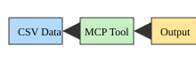

# 🚀 Model-Context-Protocol-101

[](https://www.python.org/)
[](https://opensource.org/licenses/MIT)
[](https://github.com/itprodirect/Model-Context-Protocol-101/actions)
[](https://github.com/itprodirect/Model-Context-Protocol-101/blob/main/requirements.txt)

A step-by-step tutorial exploring the **Model Context Protocol (MCP)**. This repository serves as a structured learning guide for AI/ML practitioners, consultants, and developers interested in practical **MCP implementation**.


---

## 📌 **Overview**
This repository covers:
✔️ Setting up a Python virtual environment for isolated development.  
✔️ Installing required dependencies using `pip install -r requirements.txt`.  
✔️ Understanding MCP concepts with practical code examples.  
✔️ Running Jupyter Notebooks for interactive experimentation.

---

## 🛠️ **Getting Started**

### 1️⃣ **Clone the Repository**
```bash
git clone https://github.com/itprodirect/Model-Context-Protocol-101.git
cd Model-Context-Protocol-101
```
<div style="background-color:#e6f7ff;border-left:4px solid #1e90ff;padding:10px;margin:10px 0;">
<strong>Time Saver:</strong> Having the repo locally lets independent insurance agents run examples without repeated downloads.
</div>

### 2️⃣ **Create a Virtual Environment**
```bash
python -m venv venv
# On Mac/Linux
source venv/bin/activate
# On Windows
venv\Scripts\activate
```
<div style="background-color:#e6ffe6;border-left:4px solid #28a745;padding:10px;margin:10px 0;">
<strong>Time Saver:</strong> Isolating dependencies avoids conflicts so independent agents spend less time troubleshooting setups.
</div>

### 3️⃣ **Install Dependencies**
```bash
pip install -r requirements.txt
```
<div style="background-color:#fff7e6;border-left:4px solid #ff8c00;padding:10px;margin:10px 0;">
<strong>Time Saver:</strong> A single command installs everything needed so independent agents can start experimenting right away.
</div>

### 4️⃣ **Run Jupyter Notebook**
```bash
jupyter notebook notebooks/Model-Context-Protocol-101.ipynb
```
<div style="background-color:#f0e6ff;border-left:4px solid #8a2be2;padding:10px;margin:10px 0;">
<strong>Time Saver:</strong> Interactive notebooks showcase MCP features without extra scripting, letting independent agents focus on results.
</div>

### 5️⃣ **Run Tests**
```bash
pytest
```
<div style="background-color:#ffe6e6;border-left:4px solid #dc143c;padding:10px;margin:10px 0;">
<strong>Time Saver:</strong> Quick tests confirm everything works so independent agents can iterate confidently.
</div>

---
## 🔑 Key Features

- 🚀 **MCP Server Setup**: Learn how to initialize and expand an MCP tool.
- 🔧 **Function Expansion**: Add custom tools and test them interactively.
- 📂 **CSV File Handling**: Automate CSV file reading and data extraction.
- 🎯 **Practical Exercises**: Hands-on coding exercises for better understanding.

---
## 🌟 Real-world Use Cases
Here are quick examples of how an independent insurance agent might apply MCP:
- **Automated Quotes** – load policy data from a CSV and generate quotes in seconds.
- **Lead Tracking** – triage new leads automatically using simple prompts.
- **Commission Insights** – compute profits and commissions with a single command.

To explore these datasets yourself, open the notebook
[`notebooks/Model-Context-Protocol-101.ipynb`](notebooks/Model-Context-Protocol-101.ipynb).
It demonstrates how to load `data/insurance_sales.csv` and calculate totals.

You can also inspect the CSV quickly from the command line:

```bash
python - <<'EOF'
import pandas as pd
df = pd.read_csv('data/insurance_sales.csv')
print(df.head())
EOF
```



---
## 📖 Usage Guide
This tutorial walks through how to:
✅ **Initialize the MCP Server**  
✅ **Test MCP tools locally**  
✅ **Expand MCP with custom functions**  
✅ **Read and process CSV files**  
✅ **Deploy and use MCP tools efficiently**

## 🔄 Workflow
Use the command-line interface to run common tasks directly from the terminal.

```bash
# Calculate profit from revenue and cost
python src/cli.py profit 1000 600

# Total commission from the sample dataset
python src/cli.py commission data/insurance_sales.csv
```

---
## 📂 Project Structure
```
Model-Context-Protocol-101/
├── src/                # Python utilities
├── notebooks/          # Jupyter notebooks
├── data/               # Sample datasets
├── docs/img/           # Diagrams and screenshots
├── tests/              # Unit tests
├── README.md           # Documentation
├── requirements.txt    # Dependencies
├── LICENSE             # Project License
└── AGENTS.md           # Contribution guide
```

---
## 📚 Glossary
| Term    | Meaning                                |
| ------- | -------------------------------------- |
| **MCP** | Model Context Protocol, our tooling API |
| **Lead**| Potential client for an insurance policy|
| **Premium** | Amount a customer pays for coverage |

---
## 📝 License
This project is licensed under the **MIT License**.

---
## 🤝 Contributing
Contributions are welcome! Feel free to fork the repo, submit pull requests, or suggest improvements.

---
## 📬 Contact
For questions or collaborations, connect with me on **LinkedIn** or open an **Issue** in this repository.

---
## ❓ Common Issues

**Virtual environment won't activate**
Make sure you run `python -m venv venv` and then activate it with
`source venv/bin/activate` on Mac/Linux or `venv\Scripts\activate` on Windows.
Verify Python 3.10+ is installed.

**Missing packages**
Run `pip install -r requirements.txt` from the project root while your virtual
environment is active. This installs all dependencies, including Jupyter.

**Notebook won't launch**
Activate your virtual environment and run
`jupyter notebook notebooks/Model-Context-Protocol-101.ipynb`. If the command is
not found, install Jupyter using `pip install jupyter`.

---
🔥 *This README is designed for clarity, readability, and ease of navigation!* 🚀
