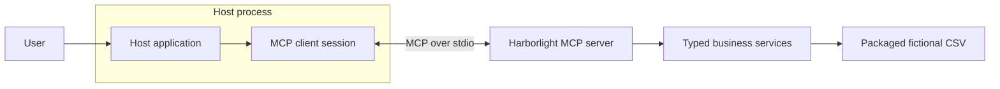
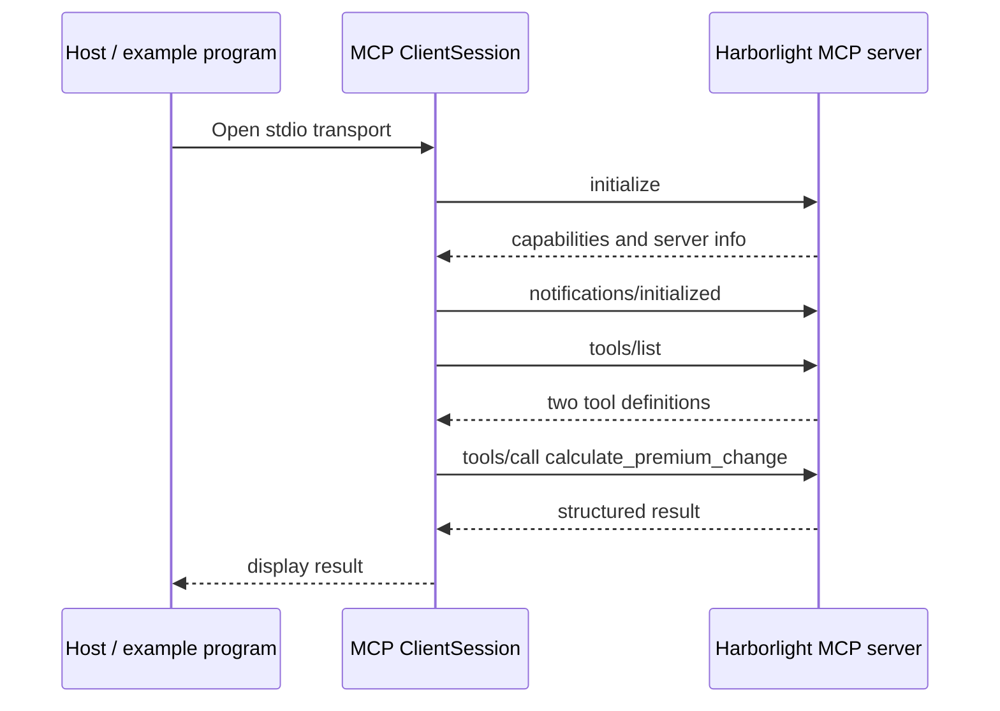
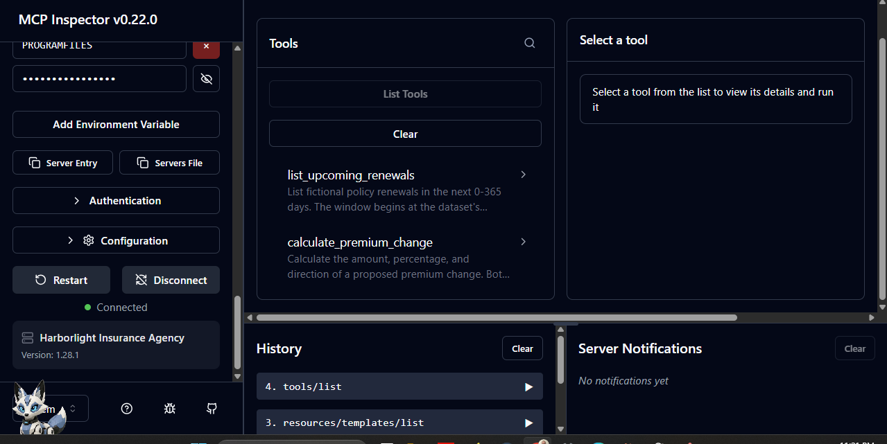

# Model Context Protocol 101: Harborlight Insurance Agency

[](https://github.com/itprodirect/Model-Context-Protocol-101/actions/workflows/ci.yml)

Build and run a small, real MCP client/server workflow that reviews fictional policy renewals and proposed premium changes.

This tutorial uses Python 3.10+ and the official stable MCP Python SDK v1. It is deliberately narrow: two read-only tools, one packaged CSV, one protocol client, and tests that cross the stdio protocol boundary.

## What MCP is

The Model Context Protocol (MCP) is an open protocol for connecting AI applications to external capabilities through a consistent client/server interface. An MCP server publishes named capabilities such as tools. An MCP client negotiates a session, discovers those tools, and invokes them using protocol messages. The host is the application that owns the user experience and manages one or more MCP clients.

MCP solves an integration problem: a host can use the same discovery and invocation model across many purpose-built servers instead of building a different adapter for every data source or operation. MCP does not make business logic correct by itself, and it is not an AI model.

MCP may be unnecessary when a normal function call, a small command-line script, or a direct HTTP API already serves one known caller. The protocol becomes useful when capability discovery, host interoperability, process isolation, or a standard tool contract matters.

## The fictional Harborlight scenario

Harborlight Insurance Agency is a fictional small business. An account manager wants to identify upcoming renewals from a fixed data snapshot and understand proposed premium changes. The tutorial exposes exactly two read-only tools:

- `list_upcoming_renewals(days: int)` returns synthetic renewals from the snapshot date through the requested day, inclusive. `days` must be from 0 to 365.
- `calculate_premium_change(current_cents: int, renewal_cents: int)` returns the change in cents, percentage, and direction. Both values must be positive whole cents.

All names and policy records are synthetic and visibly marked fictional. The server cannot accept a path from a caller; it loads only the CSV packaged with this project. It performs no underwriting, eligibility, claim, quote, carrier, advisory, or autonomous business action.

## What you will build

You will run a stdio MCP server, start a client that initializes a session, discover the server's tools, and invoke a tool across the protocol boundary. The package keeps policy parsing and arithmetic in `services.py`; `server.py` only registers those operations as MCP tools.

### Host, client, server, and data


```mermaid
flowchart LR
    User["User"] --> Host["Host application"]
    subgraph HostProcess["Host process"]
        Host --> Client["MCP client session"]
    end
    Client <-->|"MCP over stdio"| Server["Harborlight MCP server"]
    Server --> Services["Typed business services"]
    Services --> Data["Packaged fictional CSV"]
```

In `examples/protocol_client.py`, one small Python program plays both host and client roles: it presents output and owns the `ClientSession`. It starts `python -m harborlight_mcp` as the separate server process.

### Protocol sequence


```mermaid
sequenceDiagram
    participant H as Host / example program
    participant C as MCP ClientSession
    participant S as Harborlight MCP server
    H->>C: Open stdio transport
    C->>S: initialize
    S-->>C: capabilities and server info
    C->>S: notifications/initialized
    C->>S: tools/list
    S-->>C: two tool definitions
    C->>S: tools/call calculate_premium_change
    S-->>C: structured result
    C-->>H: display result
```

## Tested quickstart

Start from the repository root. The install command uses `pyproject.toml` as the dependency source of truth and includes the test and notebook tools.

### Windows PowerShell

```powershell
py -3.10 -m venv .venv
.\.venv\Scripts\Activate.ps1
python -m pip install -e ".[dev]"
```

If `py -3.10` is unavailable but `python --version` reports 3.10 or newer, use `python -m venv .venv`.

### macOS or Linux

```bash
python3 -m venv .venv
source .venv/bin/activate
python -m pip install -e ".[dev]"
```

Then run the complete automated check:

```bash
python -m ruff check .
python -m pytest
python -m nbconvert --to notebook --execute notebooks/01_mcp_101_harborlight.ipynb --output executed.ipynb --ExecutePreprocessor.timeout=120
```

The last command writes `notebooks/executed.ipynb`; remove that generated copy after inspection if desired. CI executes the tracked tutorial in the same way.

## Run the server

```bash
python -m harborlight_mcp
```

The server waits for MCP messages on stdin and writes protocol messages to stdout. An apparently idle terminal is expected. It intentionally prints no banner, status line, or normal log to stdout because that would corrupt the stdio protocol. Press `Ctrl+C` to stop a manually started server.

Most users do not need to start it separately: the example client and integration test launch their own server subprocess.

The installed console entry point is equivalent:

```bash
harborlight-mcp
```

## Run the protocol client

```bash
python examples/protocol_client.py
```

Expected successful output:

```text
Initialized MCP session.
Tools: calculate_premium_change, list_upcoming_renewals
calculate_premium_change result:
{
  "change_cents": 6000,
  "change_percent": 5.0,
  "current_cents": 120000,
  "direction": "increase",
  "renewal_cents": 126000
}
```

This is a protocol demonstration, not a direct Python call: `ClientSession` initializes a session with a separately launched server, sends `tools/list`, and sends `tools/call` over stdio.

## Connect an MCP host application

The three runnable surfaces in this repository serve different purposes:

- `examples/protocol_client.py` is a deterministic Python MCP client used to demonstrate and test protocol messages.
- MCP Inspector is an interactive debugging UI for examining schemas and calling tools directly.
- Visual Studio Code with GitHub Copilot is a real AI host application: its chat agent can discover these tools and decide when to call them while answering a user.

The following setup was checked against the current official [VS Code MCP server documentation](https://code.visualstudio.com/docs/agent-customization/mcp-servers) and [MCP configuration reference](https://code.visualstudio.com/docs/agents/reference/mcp-configuration). It was not manually exercised during this release pass.

1. Activate the environment where you installed this project, then obtain that environment's absolute Python path:

   ```bash
   python -c "import sys; print(sys.executable)"
   ```

2. In VS Code, run **MCP: Open User Configuration** from the Command Palette. Add this entry to the `servers` object in the opened `mcp.json`, replacing `<absolute-python-path>` with the path printed above:

   ```json
   {
     "servers": {
       "harborlight": {
         "type": "stdio",
         "command": "<absolute-python-path>",
         "args": ["-m", "harborlight_mcp"]
       }
     }
   }
   ```

   This configuration starts exactly:

   ```text
   <absolute-python-path> -m harborlight_mcp
   ```

   In JSON on Windows, either write the path with forward slashes or escape each backslash as `\\`.

3. Start or restart the `harborlight` server when VS Code prompts, review the configuration, and confirm that you trust this local server. In Chat, use **Configure Tools** to confirm both Harborlight tools are enabled.

4. Ask the agent a question such as:

   > Which fictional Harborlight policies renew in the next 30 days, and what is the proposed premium change for FIC-HLA-1002?

VS Code with GitHub Copilot is separate software and may require sign-in, an eligible plan, and organization permission to use MCP tools.

## Test with MCP Inspector

[MCP Inspector](https://modelcontextprotocol.io/docs/tools/inspector) requires a supported Node.js/npm installation in addition to the Python environment. With the virtual environment active, run:

```bash
npx @modelcontextprotocol/inspector python -m harborlight_mcp
```

In the Inspector:

1. Confirm the transport is `STDIO` and connect.
2. Open **Tools** and select **List Tools**.
3. Call `list_upcoming_renewals` with `{"days": 30}`.
4. Call `calculate_premium_change` with `{"current_cents": 120000, "renewal_cents": 126000}`.

The Inspector is a manual development tool and is not installed by this Python project.



> MCP Inspector connected to the Harborlight stdio server and discovered both registered tools.

## Learning path

1. Read `services.py` to see deterministic parsing, validation, filtering, and arithmetic without MCP concerns.
2. Read `server.py` to see how the official SDK's `FastMCP` interface turns typed functions into tools.
3. Run `examples/protocol_client.py` and compare it with the sequence diagram.
4. Work through `notebooks/01_mcp_101_harborlight.ipynb` for a guided package and protocol exercise.
5. Read `tests/test_protocol.py` to see automated discovery and invocation across stdio.

## Project structure

```text
Model-Context-Protocol-101/
├── .github/workflows/ci.yml
├── archive/original_notebook.ipynb
├── examples/protocol_client.py
├── notebooks/01_mcp_101_harborlight.ipynb
├── src/harborlight_mcp/
│   ├── data/fictional_policies.csv
│   ├── __init__.py
│   ├── __main__.py
│   ├── server.py
│   └── services.py
├── tests/
│   ├── test_protocol.py
│   └── test_services.py
├── .gitattributes
├── .gitignore
├── LICENSE
├── pyproject.toml
└── README.md
```

## Data and output contracts

The dataset uses an explicit `fictional_record=true` field, `FIC-` policy identifiers, fictional customer labels, ISO dates, and integer cents. Loading fails clearly if required data is missing, malformed, duplicated, or not labeled fictional.

The snapshot date is fixed at `2026-07-01`. A fixed date keeps the tutorial and tests deterministic; `days=30` always returns the same three records. Structured tool results contain only JSON-compatible strings, integers, floats, booleans, lists, and objects.

Premium change is calculated as:

```text
(renewal_cents - current_cents) / current_cents * 100
```

The percentage is rounded to two decimal places using decimal half-up rounding. Currency stays in whole cents to avoid binary floating-point money arithmetic.

## Troubleshooting

### `python` is not recognized

Install Python 3.10 or newer. On Windows, try `py -3.10`; on macOS or Linux, try `python3`. After activating the virtual environment, `python --version` should identify that environment.

### PowerShell blocks `Activate.ps1`

You can skip activation and call the environment directly:

```powershell
.\.venv\Scripts\python.exe -m pip install -e ".[dev]"
.\.venv\Scripts\python.exe examples\protocol_client.py
```

Changing the machine-wide execution policy is not required.

### The server appears to hang

That is normal when it is run by itself. A stdio server waits for framed protocol input. Run the example client in a separate command instead of typing into the server terminal.

### The client reports `No module named harborlight_mcp`

Activate the same environment used for installation and run `python -m pip install -e ".[dev]"` from the repository root.

### Protocol output is invalid or JSON parsing fails

Do not add `print()` calls, progress messages, or ordinary logging to the server's stdout. Use stderr or MCP logging notifications when diagnostics are genuinely needed.

### Inspector cannot start

Confirm `node --version` and `npx --version` work. Inspector is a separate Node.js tool; the Python test suite does not require it.

### Notebook cannot find repository files

Launch notebook execution from the repository root. The notebook intentionally relies on the installed editable package and uses repository-relative paths for the example client.

## Scope and disclaimer

Harborlight Insurance Agency, its customers, identifiers, dates, and premiums are entirely fictional. This repository is an educational example, not production software or insurance advice. It has no authentication, remote transport, database, insurer integration, real PII, underwriting logic, eligibility logic, claim logic, or autonomous actions.

## Project history

This repository began as a broad exploratory notebook. `archive/original_notebook.ipynb` is an early exploratory revision retained for historical context; it does not run against the current `harborlight_mcp` package. This focused rebuild replaces direct-call demonstrations and generated screenshots with a small package, an actual MCP client/server exchange, and executable tests. The project is maintained under the `itprodirect` repository and uses the existing MIT license.

## Official references

- [Model Context Protocol documentation](https://modelcontextprotocol.io/docs/getting-started/intro)
- [Model Context Protocol specification](https://modelcontextprotocol.io/specification/)
- [Official MCP Python SDK v1](https://github.com/modelcontextprotocol/python-sdk/tree/v1.x)
- [Official Python SDK client guide](https://py.sdk.modelcontextprotocol.io/client/)
- [MCP Inspector documentation](https://modelcontextprotocol.io/docs/tools/inspector)

## License

MIT. See `LICENSE`.
